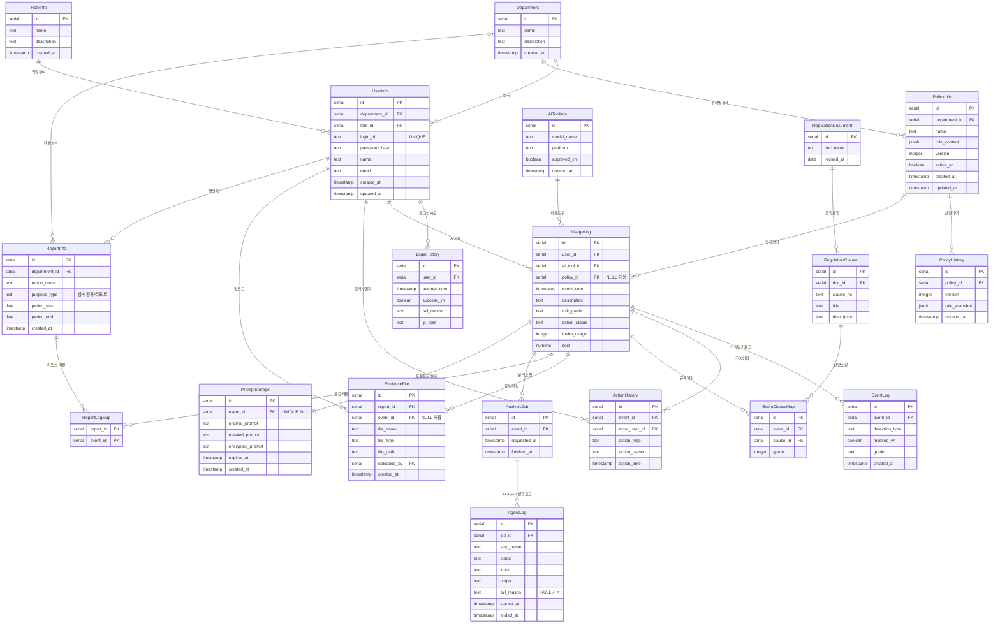

# financial-platform

---
# ERD

```mermaid
erDiagram
    Department {
        serial id PK
        text name
        text description
        timestamp created_at
    }
    RoleInfo {
        serial id PK
        text name
        text description
        timestamp created_at
    }
    UserInfo {
        serial id PK
        serial department_id FK
        serial role_id FK
        text login_id "UNIQUE"
        text password_hash 
        text name
        text email
        timestamp created_at
        timestamp updated_at
    }
    LoginHistory {
        serial id PK 
        serial user_id FK
        timestamp attempt_time
        boolean success_yn
        text fail_reason
        text ip_addr
    }
    PolicyInfo {
        serial id PK
        serial department_id FK
        text name
        jsonb rule_content
        integer version
        boolean active_yn
        timestamp created_at
        timestamp updated_at
    }
    PolicyHistory {
        serial id PK 
        serial policy_id FK
        integer version
        jsonb rule_snapshot
        timestamp updated_at
    }
    AIToolInfo {
        serial id PK
        text model_name
        text platform
        boolean approved_yn
        timestamp created_at
    }
    UsageLog {
        serial id PK
        serial user_id FK
        serial ai_tool_id FK
        serial policy_id FK "NULL 허용"
        timestamp event_time
        text description
        text risk_grade 
        text action_status 
        integer toekn_usage
        numeric cost 
    }
    EventLog {
        serial id PK
        serial event_id FK
        text detection_type 
        boolean masked_yn
        text grade
        timestamp created_at
    }
    ActionHistory {
        serial id PK
        serial event_id FK
        serial actor_user_id FK
        text action_type
        text action_reason
        timestamp action_time
    }
    RegulationDocument {
        serial id PK 
        text doc_name
        date revised_at
    }
    RegulationClause {
        serial id PK
        serial doc_id FK
        text clause_no
        text title
        text description
    }
    EventClauseMap {
        serial id PK
        serial event_id FK
        serial clause_id FK
        integer grade
    }
    EvidenceFile {
        serial id PK
        serial report_id FK
        serial event_id FK "NULL 허용"
        text file_name
        text file_type
        text file_path
        serial uploaded_by FK
        timestamp created_at
    }
    ReportInfo {
        serial id PK
        serial department_id FK 
        text report_name
        text purpose_type "상시평가/리포트"
        date period_start 
        date period_end 
        timestamp created_at
    }
    ReportLogMap {
        serial report_id PK 
        serial event_id PK
    }
    AnalysisJob {
        serial id PK 
        serial event_id FK
        timestamp requested_at
        timestamp finished_at
    }
    AgentLog {
        serial id PK 
        serial job_id FK
        text step_name
        text status
        text input
        text output
        text fail_reason "NULL 가능"
        timestamp started_at
        timestamp ended_at
    }
    PromptStorage {
        serial id PK
        serial event_id FK "UNIQUE 1to1"
        text original_prompt
        text masked_prompt
        text encrypted_prompt
        timestamp expires_at
        timestamp created_at
    }

    Department ||--o{ UserInfo : "소속"
    RoleInfo ||--o{ UserInfo : "역할부여"
    UserInfo ||--o{ LoginHistory : "로그인시도"
    Department ||--o{ PolicyInfo : "부서별정책"
    PolicyInfo ||--o{ PolicyHistory : "변경이력"
    UserInfo ||--o{ UsageLog : "AI사용"
    AIToolInfo ||--o{ UsageLog : "사용도구"
    PolicyInfo |o--o{ UsageLog : "적용정책"
    UsageLog ||--o{ EventLog : "이슈탐지로그"
    UsageLog ||--o{ ActionHistory : "조치이력"
    UserInfo ||--o{ ActionHistory : "조치수행자"
    UsageLog ||--o{ EventClauseMap : "규제매핑"
    RegulationClause ||--o{ EventClauseMap : "관련조항"
    RegulationDocument ||--o{ RegulationClause : "조항포함"
    UsageLog ||--o{ EvidenceFile : "증빙파일"
    UserInfo ||--o{ EvidenceFile : "업로드"
    UserInfo ||--o{ ReportInfo : "생성자"
    Department |o--o{ ReportInfo : "대상부서"
    ReportInfo ||--o{ ReportLogMap : "리포트 매핑"
    UsageLog ||--o{ ReportLogMap : "로그 매핑"
    UsageLog ||--o{ AnalysisJob : "분석요청"
    AnalysisJob ||--o{ AgentLog : "AI Agent 실행로그"
    UsageLog ||--|| PromptStorage : "프롬프트 보관"
```
---
